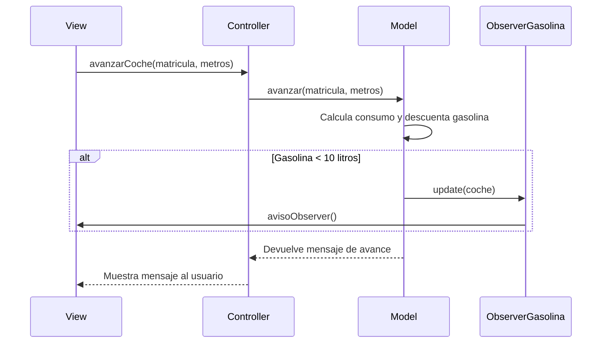

# Examen Observer con MVC
### NOTA: El codigo MVC es distinto al del otro examen porque lo hice desde 0 para cambiar cosas y que fuera mas sencillo y tambien para practicar :)
 
## Mermaid: 

## 1. Paso
Lo primero que hice fue crear la interfaz Observer y la clase ObserverGasolina, en el Observer tendrá la función update para que cada vez que haya algun cambio en la gasolina se actualice y en la clase ObserverGasolina es donde hago la comprobacion de si la gasolina que hay en el depósito es menor a 10 que mande un aviso

## 2. Paso
En el Model inicializamos un nuevo observer llamado observerGasolina y se lo añadimos al final de la función de avanzarCoche, con el update para que se actualize y le pasamos los parámetros de c que tiene la función de buscar coche, esto hace que cada vez que el coche avance el ObserverGasolina haga la comprobación

## Comprobación final:
Para comprobar si cuando la gasolina es menor a 10 simplemente le damos a avanzar al coche los metros que queramos y cuando gaste tanta gasolina que llegue a menos de 10 litros nos avisará y nos mandrá el mensaje que definimos en el ObserverGasolina 
( mas rapido podemos decir en la clase Coche que el coche inicie con menos de 10 litro y si le damos a que avance también nos lo mostrará) 

